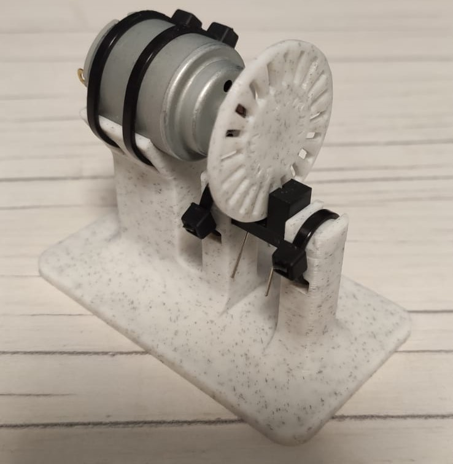
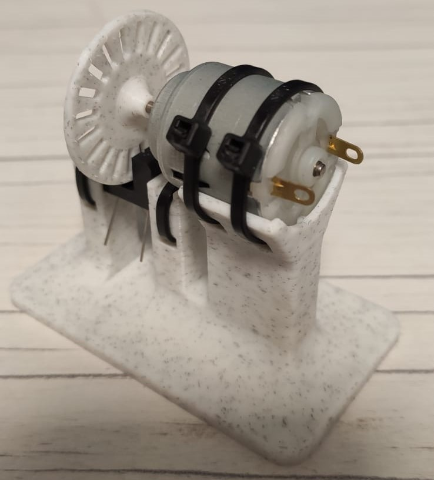
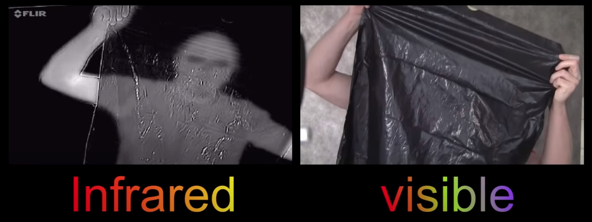
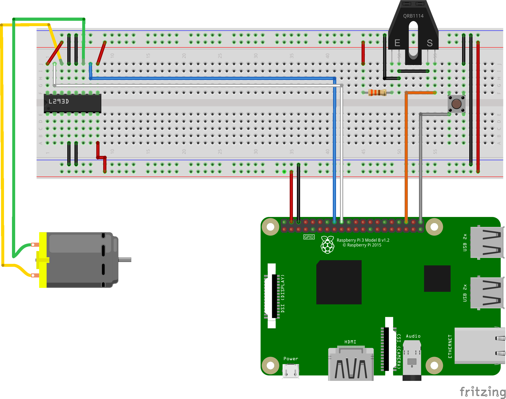
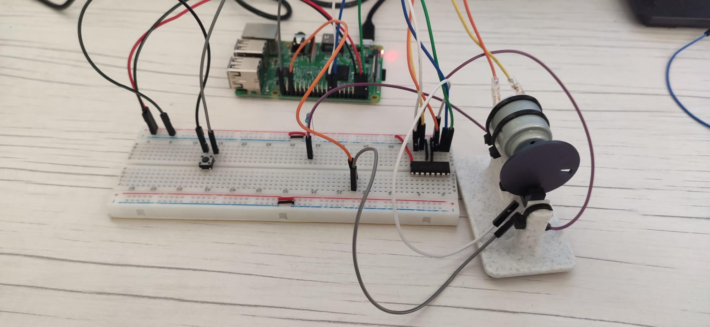
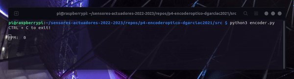

# P4-encoderOptico

This exercise consists on read the RPM of a spinning wheel using software [interruptions](https://github.com/clases-julio/p3-interruptions-dgarciac2021/wiki/Interrupt). For this particular exercise, we are using a [DC motor](https://github.com/clases-julio/p4-encoderoptico-dgarciac2021/wiki/DC-Motor) attached to a custom-designed holder to rotate the wheel. Furthermore, in order to drive such motor an additional [driver](https://github.com/clases-julio/p4-encoderoptico-dgarciac2021/wiki/L293D) is added to the circuit. You might want to take a look on the wiki, since there is info of everything involved on this project. From the motor to the [sensor](https://github.com/clases-julio/p4-encoderoptico-dgarciac2021/wiki/ITR8102) to the [infrared radiation!](https://github.com/clases-julio/p4-encoderoptico-dgarciac2021/wiki/Infrared-Radiation)

## Motor Holder




The motor holder showed above was designed specifically for this project. The software used was [Fusion 360](https://www.autodesk.com/products/fusion-360/). Although this is non-free propietary software, it is free for educational purposes as shown [here.](https://www.autodesk.com/products/fusion-360/education)

However the use of this holder was not that straight-forward, since apparently **some materials used on FDM printers** (Like PLA or ABS) **could became *invisible* for certains wavelengths, like the infrared ones**. In our case this made the sensor remain conductive despite of the wheel spinning in front of it. All details are covered in this [article.](https://www.ncbi.nlm.nih.gov/pmc/articles/PMC8208549/)

You can see how different materials behave with infrared radiation in this [video](https://www.youtube.com/watch?v=fpx7hsoYEt4), but with this frame you can get the idea:



Fortunately, the solution for us was just use another brand of filament that can actually block the infrared light due to the pigments and impurities that the manufacturer added during the manufacturing process. That is why in the final images a different wheel is finally used. However this is not a practical solution since it requires of an extensive trial/error process. It is also not consistent due to the same color can show differents behaviour between brands, or even different colors of the same manufacturer could be completly different on this terms.

Another consistent solution could be simply mask the wheel with some reflective material, like aluminum tape or similar. You can find all the 3D files [here.](https://github.com/clases-julio/p4-encoderoptico-dgarciac2021/tree/main/res/models)

### Holder Assembly instructions

You will only need four zip ties with **less than 4mm width**. There are two smaller pieces which are used to clamp the ITR8102 to the base with the help of two zip ties. The rest of them are for fix the motor in place as shown in the images above. The spinning wheel relies on press fit and nothing more.

## Circuit Assembly

With the addition of the DC motor driver, wiring could became a little bit messy and more complex than previous exercises. We are using one [button](https://github.com/clases-julio/p3-interruptions-dgarciac2021/wiki/Button), one driver, one 330Ω resistor and the ITR8102 sensor provided with our Raspberry Pi kits.[^1]

The electrical principle consists on whenever the sensor detects the light of the emitter, it will short the given GPIO to ground, switching its state from `HIGH` to `LOW`.

This is an schematic made with [Fritzing](https://fritzing.org/):



And this is the real circuit!



## Code

We would like to highlight some remarkable aspects from our code.

```python3
print("CTRL + C to exit!", end="\n\n")
```

The end of each `print` command could be customized to our needs, in this case leaving a blank line after printing the message. `\r` means *Carriage Return*, which sets the printer cursor at the beginning of the terminal line. Once there you can overwrite the output and thus create the ilusion of a live output.

```python3
print("RPM: ", int(calculateRPM()), end="\r")
```

```python3
global var
```

The `global` label will link any local variable to its homonymous global variable. Although this is usually a bad practise, we were searching for simplicity in this case.

```python3
RPM_PRINT_TIMER = 0.250
rpmPrintPrevTime = 0

while True:
	if (time.time() - rpmPrintPrevTime >= RPM_PRINT_TIMER):
		rpmPrintPrevTime = time.time()
```

This whole snippet is a port from the *[blink without delay](https://www.arduino.cc/en/Tutorial/BuiltInExamples/BlinkWithoutDelay)* example for Arduino based boards. Basically it sets a time milestone and checks for the internal timer continously. Once the result of substract the last milestone to the current time matches a given time, we do whatever is pretended and refresh the milestone to the current time. This is how you can keep track of time on different procedures without blocking the code execution.

Pretend this timer is actually a human being. He is looking at a wall clock with two numbers drawn on both of his hands. In one of them he has the last time when I asked him for the timer and he answer *Yes, the time has expired* and in the other hand he has the time I would like to keep track of. Once I tell him *Start counting!* he will calculate if the current time minus the time when I last said to him *Start counting!* (The time written of its hand) matches the number written on his other hand. I will ask him if that time arrived as fast as my hardware allows me. Eventually, that time will arrive and as soon as I ask him he will say *Yes! The time expired!* and thats the signal I need to do whatever the *heck* I need without taking care of the clock or neglect other tasks. Once I'm done with that timed task, I can say to my personal clock watcher *Start counting again!* and the cycle will continue for ever.

Now pretend this humang being never existed and it always have been yourself, with your hands written and your own wall clock!

## Circuit testing

This is the result! Pretty nice, isn't it?




[^1]: The ITR8102 is not listed on the Fritzing libraries, so another alternative with identical wiring is used to represent it.
